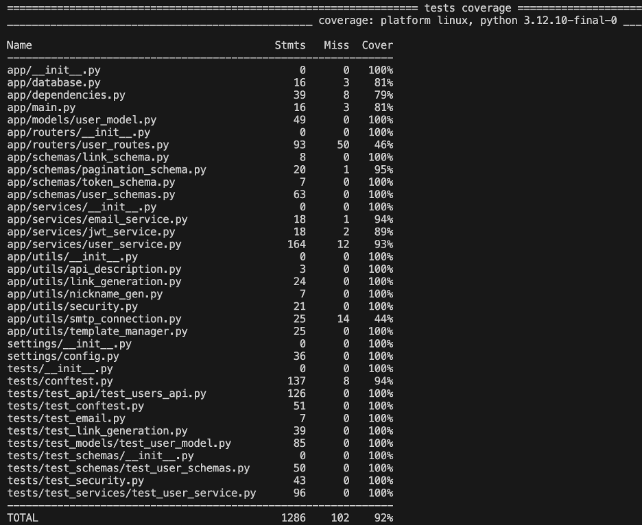

# Event Manager Company: Software QA Analyst/Developer Onboarding Assignment

## Issues Fixed:

Issue1-

The nickname used in the curl requests did not match the one shown in the example, which led to confusion while using the API. This has been resolved to ensure consistency between the cURL request and the example for better clarity and usability.

[Issue#1](https://github.com/ASKANADE18/event_manager/issues/1)

Issue2– 

An error occurs when attempting to create a new user with a nickname that is similar to an existing one. However, multiple users can have the same nickname, so this restriction may not be necessary.

[Issue#2](https://github.com/ASKANADE18/event_manager/issues/8)

Issue3-

Currently, email verification requires a UUID, which is not very convenient. Allowing verification directly through the email ID would improve usability, as email addresses are unique identifiers. This change would streamline the process and enhance the user experience.

[Issue#3](https://github.com/ASKANADE18/event_manager/issues/10)

Issue4-

We need to ensure that all URLs are valid. Proper URL validation should be implemented, and if an invalid URL is provided, it should raise an appropriate error. This can be verified and tested using automated test cases.

[Issue#4](https://github.com/ASKANADE18/event_manager/issues/12)

Issue5-

The test_login_request_valid is failing because the LoginRequest object requires an email field, but the test fixture does not include the email field.

[Issue#5](https://github.com/ASKANADE18/event_manager/issues/16)

## Docker Hub
[Dockerhub_Link](https://hub.docker.com/repository/docker/askanade18/event_managerapi/general)

## Test Coverage
Pytest is used for test coverage. Ensure the container is running and execute:

## Learning from this assignment
This assignment provided a valuable opportunity to strengthen both my technical abilities and teamwork skills. I developed a solid understanding of the user lifecycle, debugging techniques, and enhancing functionality with a quality assurance mindset. Using Docker Compose, I learned how microservices interact and how to troubleshoot issues with tools like pgAdmin.

Creating test cases and improving code coverage reinforced the importance of dependable testing practices. Resolving issues such as UUID-based email verification and nickname conflicts pushed me to consider both user experience and backend logic. I also recognized the value of code reuse, consistency, and effective communication between QA and development teams.

Overall, this experience increased my confidence in handling complex systems and emphasized how thoughtful design and thorough testing are key to building robust applications.
